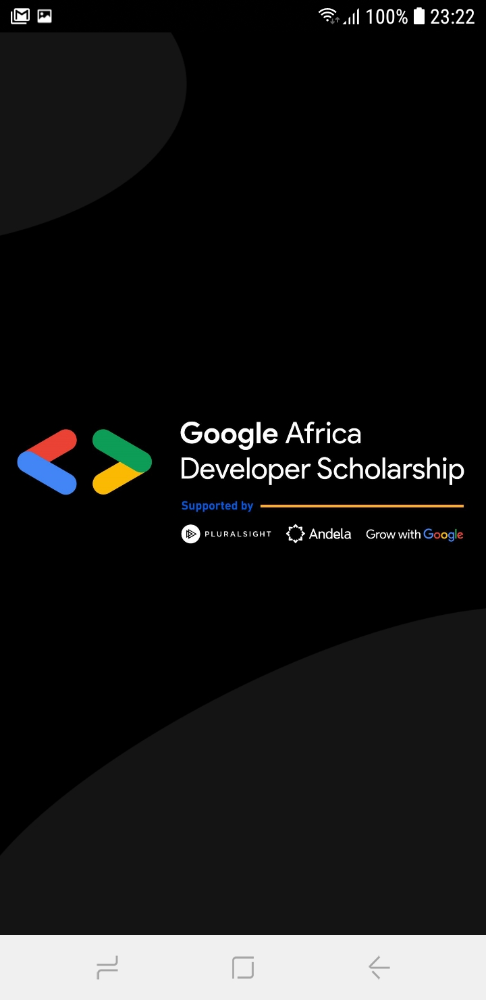
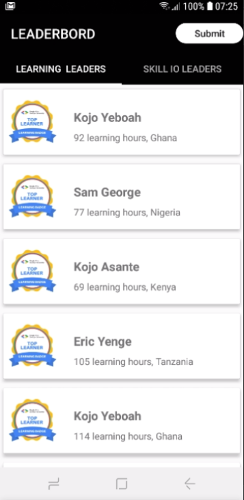
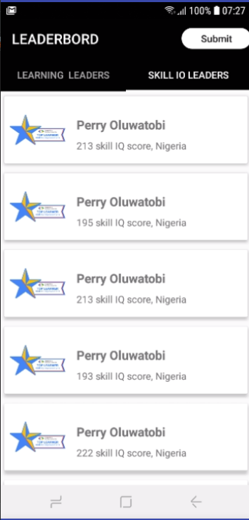
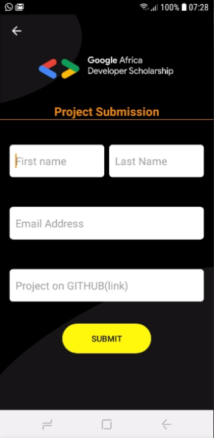
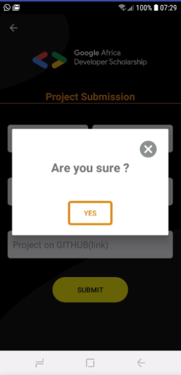
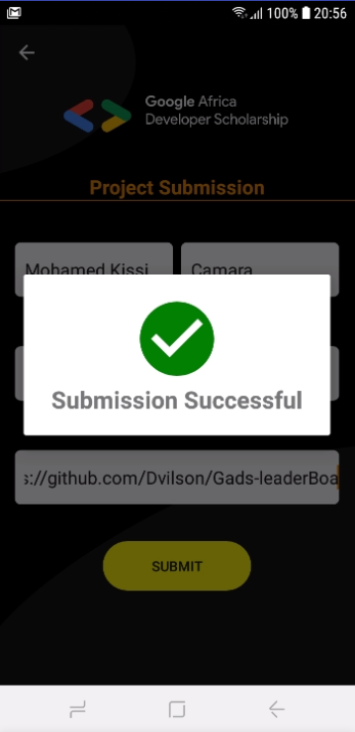
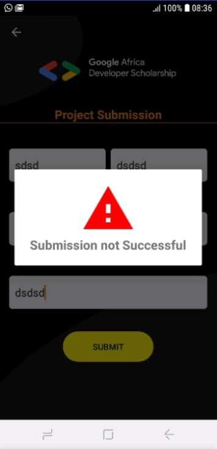

# Gads-leaderBoard
A leaderboard of the top 20 of the most learners with learning hours and with skill IQ. The second activity allow you to submit your project to the GADS 20 google form.
## Summary

Practice project of GADS 20.

<b>Made with love.</b>

## Screenshots
<table style="width:100%">
  <tr>
    <td></td>
    <td></td>
    <td></td> 
    <td></td>
  </tr>
  <tr>
    <td></td>
    <td></td>
    <td></td>
  </tr>
</table>
